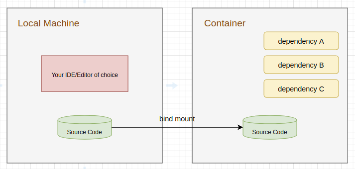

<h2 align="center">Spending Journal</h2>

<h3>How much did I spend yesterday/ last week / last month, and what are they?</h3>

Everything in Spending Journal was designed to help us answer such questions :wink: :wink: :wink:
 
<h3>Installation</h3>

<h4>For Development</h4>

We make use of Docker containers to free us from <b>directly installing development dependencies</b> on our machines, as well as to <b>provide a common development environement</b> for all the contributors.

The idea is to mount the source code of each module into a corresponding container.

  

